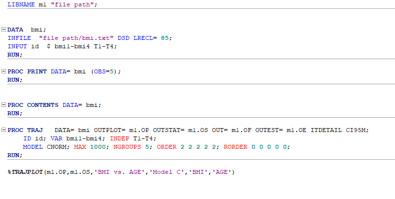
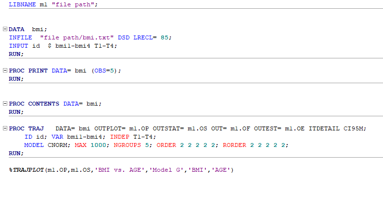

```{r setup, include = FALSE}
library(knitr)
knitr::opts_chunk$set(
  collapse = TRUE,
  comment = "#>"
)
```


### Motivation

Latent class trajectory modelling (LCTM) is a relatively new methodology in epidemiology to describe life-course exposures, which simplifies heterogeneous populations into homogeneous patterns or classes. However, for a given dataset, it is possible to derive scores of different models based on number of classes, model structure and trajectory property. Here, we rationalise a systematic framework to derive a core favoured model. We recently outlined a framework to construct and select a core LCTM, which will facilitate generalisability of results in future studies.

All statistical (R and SAS) codes for the tools used to guide selection of Latent Class Trajectory Modelling are described in the manuscript "A framework to construct and interpret latent class trajectory modelling" are available in an R package called LCTMtools.

To install the R package, in the R console use the command

> devtools::install_github("hlennon/LCTMtools")


### References

Lennon H, Kelly S, Sperrin M, et al Framework to construct and interpret latent class trajectory modelling BMJ Open 2018;8:e020683. doi: 10.1136/bmjopen-2017-020683

Available at https://bmjopen.bmj.com/content/8/7/e020683.


### Example

An example (simulated) dataset *bmi* is provided to describe the steps throughout, and *bmi_long* is the long format version. 
Five classes of BMI trajectories across adult lifetime for N=10,000 individuals.

```{r}
library(LCTMtools)
data(bmi_long, package = "LCTMtools")
```

Fit a two class trajectory model for age allowing for random quadratic effects using the *lcmm* R package (Prost-Lima et al., 2017)


```{r mod2, cache=TRUE}
library(lcmm)
set.seed(100)
model2class <- hlme(fixed = bmi ~ 1 + age + I(age), 
                    mixture = ~ 1 + age, 
                    random= ~ age,
                    nwg=TRUE, ng=2, 
                    subject="id", data=bmi_long)
```


```{r  mod2pp, cache=TRUE}
postprob(model2class)
```


```{r  mod2tk, cache=TRUE}
LCTMtoolkit(model2class)
```


We can also compare models

```{r  mod3, cache=TRUE}
set.seed(100)
model3class <- hlme(fixed = bmi ~ age + I(age^2), 
                    mixture = ~ age + I(age^2), 
                    random= ~ age,
                    nwg=TRUE, ng=3, 
                    subject="id", data=bmi_long)
```


```{r mod23, cache=TRUE}
LCTMcompare(model2class, model3class)
```
\   
\   
 

# An example of the eight step framework for Latent class trajectory modelling

Example: modelling BMI as a function of age. Latent classes were used to identify subgroups of participants with distinct trajectories. 

The equations models A to G, to model longitdinal outcome $y_{ijk}$, for $k=1:K,$ classes, for individual $i$, at time point $j$, $t_j$ are  


Model A:   
$$y_{ijk}=\beta_0^{(k)} + \beta_1^{(k)} t_{ij} + \beta_2^{(k)} t^2_{ij} + \epsilon_{ij}}, $$
where the residual variance is assumed equal across all classes, $\epsilon_{ij}\sim N(0, \sigma^2)$.  


Model B:   

$$y_{ijk}=\beta_0^{(k)} + \beta_1^{(k)} t_{ij} + \beta_2^{(k)} t^2_{ij} + \epsilon_{ijk}}, $$
where the residual variances are assumed different across $\epsilon_{ijk} \sim N(0, \sigma_k^2)$.  


Model C:   
For $k=1:K,$ classes, for individual $i$, at time point $j$, $t_j$, 
$$y_{ijk}=\beta_0^{(k)} + \beta_1^{(k)} t_{ij} + \beta_2^{(k)} t^2_{ij} + b_0^{(k)}  +  \epsilon_{ij}}, $$
where the random effect distibruion $b_0 \sim N(0, B)$.  


Model D:   
For $k=1:K,$ classes, for individual $i$, at time point $j$, $t_j$, 
$$y_{ijk}=\beta_0^{(k)} + \beta_1^{(k)} t_{ij} + \beta_2^{(k)} t^2_{ij} + b_0^{(k)} + + b_1^{(k)} t_{ij} \epsilon_{ij}}, $$
where the random effects assumed to be distributed as $b_0 \sim N(0, B)$.  


Model E:   
For $k=1:K,$ classes, for individual $i$, at time point $j$, $t_j$, 
$$y_{ijk}=\beta_0^{(k)} + \beta_1^{(k)} t_{ij} + \beta_2^{(k)} t^2_{ij} + b_0^{(k)} + + b_1^{(k)} t_{ij} \epsilon_{ij}}, $$
where the random effects assumed to be distributed as $b_0 \sim N(0, B)$.  


Model F:   
For $k=1:K,$ classes, for individual $i$, at time point $j$, $t_j$, 
$$y_{ijk}=\beta_0^{(k)} + \beta_1^{(k)} t_{ij} + \beta_2^{(k)} t^2_{ij} + b_0^{(k)} + + b_1^{(k)} t_{ij} \epsilon_{ij}}, $$
where the random effects assumed to be distributed as $b_0 \sim N(0, B)$.  


Model | Description | Interpretation | Software | Command |   
     
A  | Fixed effects homoscedastic | No random effects – with the interpretation that any deviation of an individuals trajectory from its mean class trajectory is due to random error only
 | SAS traj
PROC TRAJ | 
 (common residual variance across classes)
          
    
B | 
 | Fixed effects
 | (class-specific residual variances)
 | heteroscedastic
 | The same interpretation as Model A with random errors that can be larger and smaller in different classes.
 | R mmlcr

 
         
    
C
Random intercept
The interpretation is allowing individuals to vary in initial weight but each class member is assumed to follow the same shape and magnitude of the mean trajectory
SAS traj
PROC TRAJ
(7)
          
    
D
Random slope
Allowing individuals to vary in initial weight and slope of the mean trajectory but same curvature as trajectory
SAS traj
PROC TRAJ
(7)
          
    
E
Random quadratic – Common variance structure across classes
Additional freedom of allowing individuals to vary within classes by initial weight, shape and magnitude, however each class is assumed to have the same amount of variability
R lcmm
hlme/lcmm
         
    
F
Random quadratic – Proportionality constraint to allow variance structures to vary across classes
Increasing flexibility of model E as variance structures are allowed to differ up to a multiplicative factor to allow some classes to have larger or smaller within-class variances. This model is can be thought of more parsimonious version of model G from (reducing the number of variance-covariance parameters to be estimated from 6xK parameters to 6+(K-1) parameters.
R lcmm
hlme/lcmm
          
   


We used maximum likelihood approaches to fit the model with the *hlme* function from the *lcmm* library in the R software environment and cross-checked results using the PROC TRAJ function in SAS traj library (SAS Institute, Cary, North Carolina, USA).


## STEP 1:
We initially constructed a scoping model provisionally selecting the plausible number of classes based on available literature; in the context of BMI trajectories, we used $K=5$ classes as reported elsewhere.

To determine the initial working model structure of random effects, we followed the rationale of Verbeke and Molenbergh and examined the shape of standardised residual plots for each of the five classes in a model with no random effects. If the residual profile could be approximated by a flat, straight line or a curve, then a random intercept, slope or quadratic term, respectively, were considered. Preliminary plots suggested preference for a quadratic random effects model (supplementary figure S1).


#' Step 1: Select the form of the random effect structure

Fit a latent class modelel with no random effects, e.g. in the lcmm package in R this can be done by specifying $\verb|random=~-1|$. As a rough working modelel, chose fixed effects form and number of likely classes, e.g. here k = 5.
```{r}
data(bmi_long)
model1 <- lcmm::hlme(fixed=bmi~1+age+I(age^2),
                   mixture = ~1+age+I(age^2),
                   random=~-1,
                   ng=5,
                   nwg=FALSE, data=bmi_long[1:200,],
                   subject="id")
```


We then feed the fitted model to the step1 function in LCTMtools to examine the class speciifc residuals. 

```{r eval=FALSE, fig.align="center", fig.height=3, fig.width=5, message=FALSE}
residualplot_step1(model1)
```


## STEP 2
We refined the preliminary working model from step 1 to determine the optimal number of classes, testing $K=1, ... 7$. 
The number of classes chosen can be chosen here based on the lowest Bayesian information criteria (BIC).

```{r wm, cache=TRUE, message=FALSE, warning=FALSE}
set.seed(100)
m.1 <- hlme(fixed = bmi ~1+ age + I(age^2),
            random = ~1 + age,
            ng = 1,
            idiag = FALSE, 
            data = bmi_long[1:200,], subject = "id")
lin <- c(m.1$ng, m.1$BIC)

for (i in 2:7) {
  m.i <- hlme(fixed = bmi ~1+ age + I(age^2),
              mixture = ~1 + age + I(age^2),
              random = ~1 + age,
              ng = i, nwg = TRUE, 
              idiag = FALSE, 
              data = bmi_long[1:200,], subject = "id")
  
  lin <- rbind(lin, c(i, m.i$BIC))
}

modelout <- knitr::kable(lin, col.names = c("k", "BIC"), row.names = FALSE, align = "c")
modelout
```


##Step 3
We further refined the model using the favoured K derived in step 2, testing for the optimal model structure. We tested seven models (detailed in online supplementary table S2), ranging from a simple fixed effects model (model A) through a rudimentary method that allows the residual variances to vary between classes (model B) to a suite of five random effects models with different variance structures (models C-G).
\   
\   


*    **Model A (SAS, PROC TRAJ)**

```{r echo=FALSE, fig.align="center", fig.height=3, fig.width=5, message=FALSE}
include_graphics("figures/Mod_A_SAS.png")
```

\   
\   

*    **Model B (R, mmlcr)**

Install the R mmclr package from github using

> devtools::install_github("cran/mmlcr")

```{r results="hide",  message=FALSE, warning=FALSE}
library(mmlcr)
m.b <- mmlcr(outer = ~1|id, 
             components = list(list(formula = bmi~1 + age +I(age^2),
                                  class = "normlong", min = -1000, max = 5000)),
             data = bmi_long[1:200,], n.groups = 5, max.iter = 2000, tol = 0.001)
```

``` {r}
m.b$BIC
```
\   
\   

*    **Model C (SAS, PROC TRAJ)**

```{r, echo=FALSE, fig.width=5, fig.align="center", fig.height=3,  message=FALSE, warning=FALSE}


```
\   
\   


*    **Model D (SAS, PROC TRAJ)**

```{r, echo=FALSE, fig.width=5, fig.align="center", fig.height=3}
include_graphics("Mod_D_SAS.png")
```
\   
\   


*    **Model E (R, lcmm)**
``` {r mode,cache = TRUE}
m.e <- hlme(fixed = bmi ~1+ age + I(age^2),
           mixture = ~1 + age + I(age^2),
            random = ~1 + age,
            ng = 5, nwg = F, 
            idiag = FALSE, 
            data = bmi_long[1:200,], subject = "id")
```

```{r}
m.e$BIC
```
\   
\   
    
*    **Model F (R, lcmm)**
``` {r modf,cache = TRUE}
m.f <- hlme(fixed = bmi ~1+ age + I(age^2),
           mixture = ~1 + age + I(age^2),
            random = ~1 + age,
            ng = 5, nwg = T, 
            idiag = FALSE, 
            data = bmi_long[1:200,], subject = "id")
```

```{r}
m.f$BIC
```    
\   
\   
    
*    **Model G (SAS, PROC TRAJ)**

```{r, echo=FALSE, fig.width=5, fig.align="center", fig.height=3}

```


## Step 4
We then performed a number of model adequacy assessments. 
First, for each participant, we calculated the posterior probability of being assigned to each trajectory class and assigned the individual to the class with the highest probability. 
An average of these maximum posterior probability of assignments (APPA) above 70%, in all classes, is regarded as acceptable. 
We further assessed model adequacy using odds of correct classification, mismatch

```{r lctm, cache=TRUE, warning=FALSE, message=FALSE}
LCTMtoolkit(m.f)
```

## Step 5
We used three graphical presentation approaches; 

1. Plot mean trajectories with time encompassing each class


2. Mean trajectory plots with 95% predictive intervals for each class, which displays the predicted random variation within each class

```{r plotpred, cache=TRUE, fig.align="center",fig.width=5, fig.height=4}
datnew   <- data.frame(age = seq(18, 65, length = 100))
plotpred <- predictY(m.f,datnew, var.time ="age", draws = TRUE)
plot(plotpred, lty=1, xlab="Age", ylab="BMI", legend.loc = "topleft", cex=0.75)


```

3. Individual level 'spaghetti plots' with time, depending on sample size maybe use a random sample of participants
```{r spagplot, cache=TRUE, echo=TRUE,fig.align="center", fig.width=5}
library(ggplot2)
ggplot(bmi_long, aes(x = age, y = bmi)) + geom_line(aes(color = id,group = id), colour = "grey") + xlab("Age") + ylab("BMI")

ggplot(bmi_long, aes(x = age, y= bmi)) + geom_line(aes(color = true_class,group = id)) + xlab("Age") + ylab("BMI") + labs(color = "Class Assignment")

```

## Step 6

We assessed model discrimination, including degrees of separation (DoSK), and Elsensohn's envelope of residuals.


## Step 7 
Assessing clinical characterisation and plausibility using four approaches;

**1.** Assessing the clinical meaningfulness of the trajectory patterns, aiming to include classes with at least 1% capture of the population 

``` {r pprob, cache=TRUE}

lcmm::postprob(m.f)

```


**2.** Assessing the clinical plausibility of the trajectory classes

Use the plots generated in *6.2* to assess whether the predicted trends seem realistic for the group that is being studied. E.g. for studying BMI, a predicted trend showing a drop to <5 kg/m^2^ would be unrealistic as this is unsustainable for life.
\   
\    

**3.** Tabulation of characteristics by latent classes versus conventional categorisations 

Extract class assignments from chosen model using;

```{r, eval=FALSE}
m.f$pprob[,1:2]
```
 and then feed back into main dataset with descriptive variables.
 
This can then be tabulated as needed.

```{r, eval=FALSE}
table(x$class)
rbind(by(x$VARIABLE, x$class, meanSD))


```
e.t.c..

**4.** Concordance of class membership with conventional BMI category membership using the kappa statistic 

```{r ks, cache=TRUE}
# Defining BMI categories, these need to be in equal number to the number of classes derived
library(dplyr)
library(kableExtra)
library(caret)
bmi_long <- bmi_long %>% mutate(bmi_class = case_when(bmi<18.5~ 1,
                                                bmi>=18.5 & bmi<25 ~ 2,
                                                bmi>=25 & bmi<30 ~ 3,
                                                bmi>=30 & bmi<35 ~ 4,
                                                bmi>=35 ~ 5))
bmi_long$true_class <-  as.factor(bmi_long$true_class)
bmi_long$bmi_class <- as.factor(bmi_long$bmi_class)
levels(bmi_long$true_class) <- c("1","2","3", "4", "5")
x <- confusionMatrix(bmi_long$true_class, bmi_long$bmi_class, dnn=c("Latent Class", "BMI Class"))
y <- as.matrix(x$table)
colnames(y) <- c("<18.5", "18.5-24.9", "25 - 29.9", "30.0-34.9", "<35")
kable(y, row.names = T, align="c") %>%  column_spec(1, bold = T, border_right = T) %>% kable_styling() %>% add_header_above(c("Latent Class"=1, "BMI Class" = 5))
```


##Step 8
We conducted sensitivity analyses, in this example, with individuals with at least two and three BMI values, as LCTMs are flexible enough to deal with different observation times between participants.


